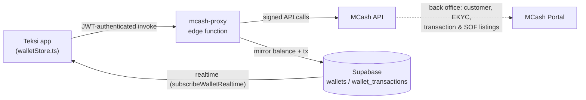
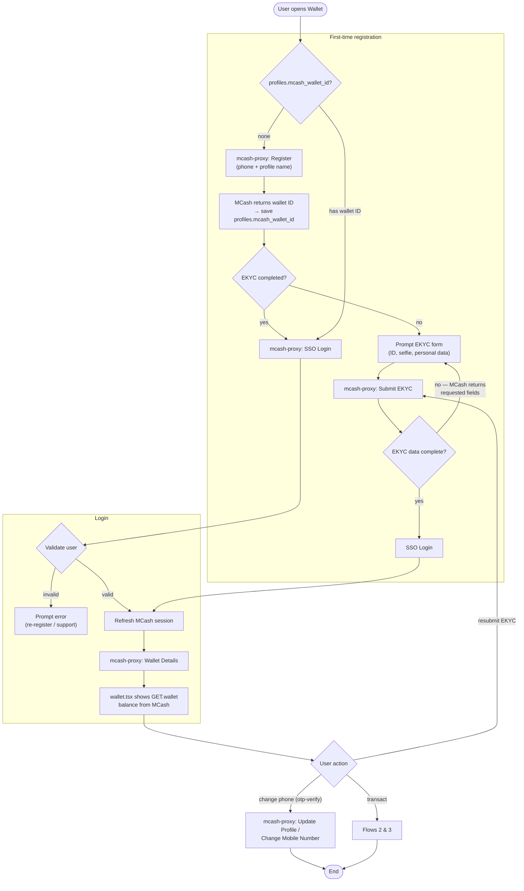
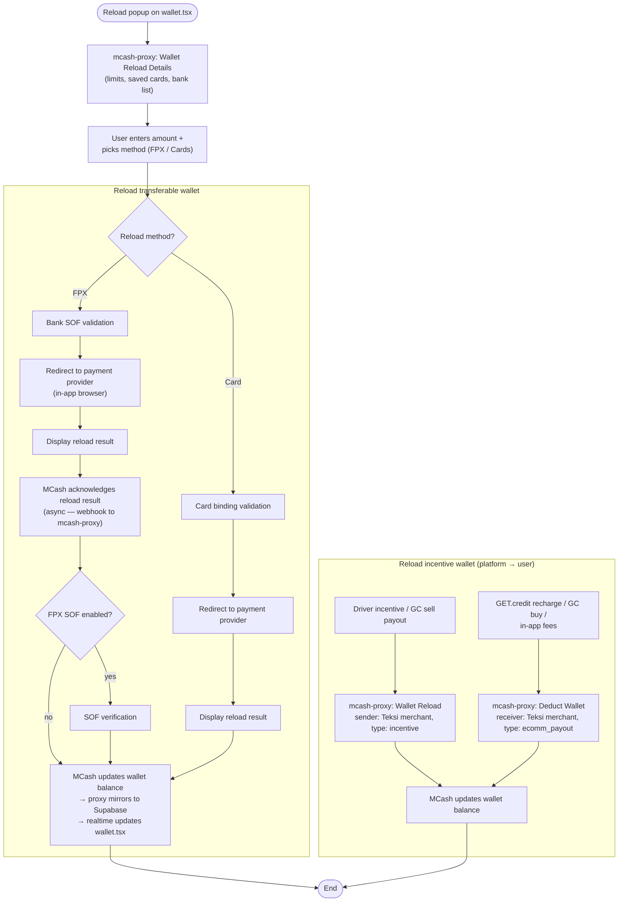
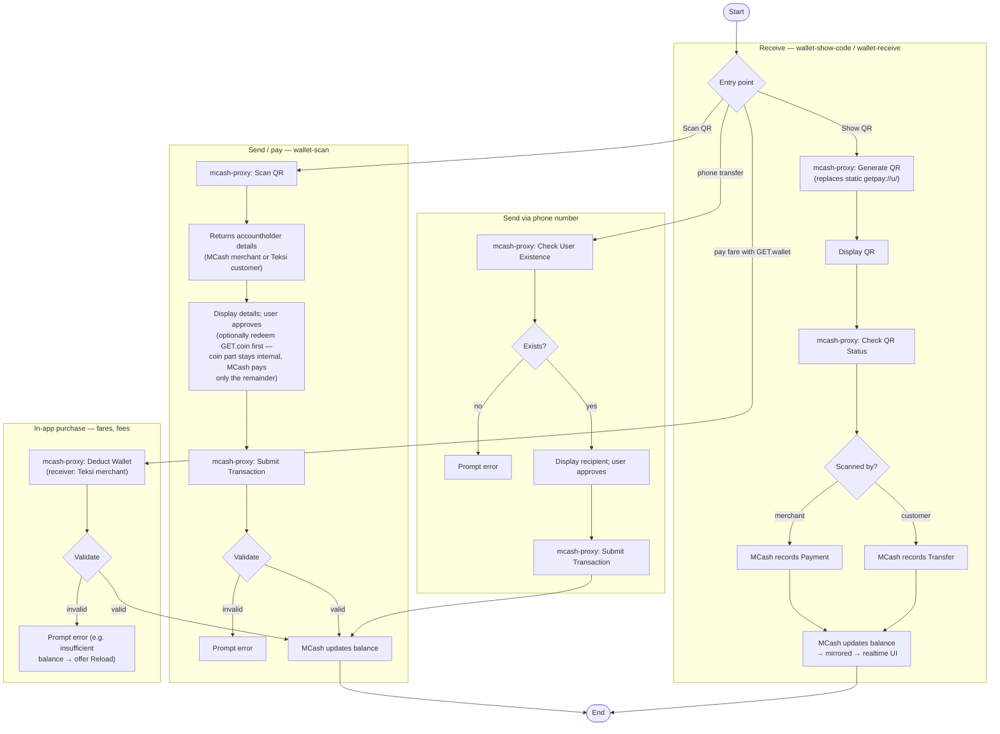

# GET.wallet × MCash — Integration Flow

This document specifies how **GET.wallet** (the master wallet in the Teksi app) is re-based onto
**MCash** so that the wallet is *actually held by MCash* — MCash becomes the custodian and ledger of
record for GET.wallet money, while the app keeps its current UI and the Supabase ledger becomes a
read-side mirror. It follows the three MCash partner-integration diagrams (Onboarding, Wallet
Reload, Wallet Transfer & Payment), with the **Teksi app** taking the "Eastel App" role.

## Scope — which wallet moves to MCash

| Wallet | Today | With MCash |
|---|---|---|
| **GET.wallet** (`get_wallet`) | Supabase ledger (`wallets` / `wallet_transactions`, RPCs from migration `0066`) | **Held by MCash.** Every balance change is an MCash API call; Supabase mirrors the balance + transactions for realtime UI and history. |
| **GET.credit** (`get_credit`) | Supabase ledger | Stays internal. Recharging GET.credit becomes an MCash **Deduct Wallet** (money leaves the customer's MCash wallet to the Teksi merchant account) followed by the internal `wallet_recharge_credit` credit-in. |
| **GET.coin** (`get_coin`) | Supabase ledger | Stays internal (GC is a reward point, not e-money). Buying GC on `wallet-trade` becomes an MCash **Deduct Wallet**; selling GC becomes an MCash **Wallet Reload** (type `incentive`) from the Teksi merchant account. |

Because MCash is a licensed e-money issuer, the split matters: **RM value lives in MCash;
points/credit stay in our ledger.**

## Architecture

All MCash calls go through a new **`mcash-proxy` Supabase edge function** (same pattern as
`ai-route-proxy`): the MCash API credentials/signing keys live server-side and never reach the
client. The proxy verifies the caller's Supabase JWT (`auth.uid()`), resolves the caller's
`mcash_wallet_id` from `profiles`, calls MCash, and writes the mirror rows
(`wallets.balance`, `wallet_transactions`) with the service role.

Client touchpoint: `expo/utils/walletStore.ts` gains an MCash branch that is preferred when the
profile has an `mcash_wallet_id`. The existing Supabase RPC path and the AsyncStorage path remain as
fallbacks, per the repo's graceful-degradation convention.

New profile columns (new migration): `mcash_wallet_id`, `mcash_ekyc_status`
(`never_submit | pending_screening | pending_review | approved | rejected | on_hold | next_screening_due`),
`mcash_customer_status` (`active | inactive | partial_blocked | blacklisted | terminated`).
New mirror column: `wallet_transactions.status`
(`success | failed | pending | processing | paused | cancelled`) with `mcash_ref` for reconciliation
— today every ledger row is implicitly final, but FPX reloads are asynchronous.

---

## Flow 1 — Onboarding (wallet provisioning)

Runs the first time a signed-in Teksi user opens `app/wallet.tsx`. The app's own auth is unchanged
(`phone-auth` → `otp-verify` → PIN); MCash onboarding piggybacks on it — the verified phone number
is the MCash customer identity.

Code mapping:

- The wallet-ID check + Register happen in a new `ensureMcashWallet(userId)` in `walletStore.ts`,
  called from `wallet.tsx` on focus (where `fetchWalletBalances` runs today).
- EKYC form is a new screen `app/wallet-ekyc.tsx` (flat `Stack.Screen` in `_layout.tsx`, per
  routing convention). Until `mcash_ekyc_status = approved`, the wallet is view/reload-only with
  MCash's unverified limits; the screen surfaces the EKYC status returned by MCash.
- Phone-number changes already re-verify by OTP; after `verifyOtp` succeeds the app calls the
  proxy's **Update Profile/Change Mobile Number** so the MCash identity follows.
- Customer status (`active`/`blacklisted`/…) from **Customer Listing** is checked on SSO Login; a
  blocked status disables wallet actions in the UI with a support prompt.

## Flow 2 — Wallet Reload (GET.wallet top-up)

Replaces the current simulated top-up (`topUpWallet` → `wallet_topup` RPC, which just mints balance).
The Reload popup on `wallet.tsx` (amount + FPX / Cards method cards) stays as-is; the money now
really moves through MCash.

Key changes vs. today:

- `topUpWallet(userId, amount, method)` becomes *initiate reload*: it returns a payment-provider
  URL from the proxy instead of instantly crediting. A mirror `wallet_transactions` row is written
  with `status = pending` and finalized (`success`/`failed`) when MCash's acknowledgment webhook
  hits the proxy — the existing realtime subscription then refreshes the UI, so no polling.
- Transaction statuses (`Success / Failed / Pending / Processing / Paused / Cancelled`) come from
  MCash's **Transaction Listing & Wallet Movement**; `wallet-history.tsx` shows the status chip on
  pending rows.
- `rechargeCredit` (GET.wallet → GET.credit) becomes: proxy **Deduct Wallet**
  (`type: ecomm_payout`, funds land in the Teksi MCash merchant account) → on success, internal
  `wallet_recharge_credit` credit-in only. Same pattern for GC buys on `wallet-trade.tsx`; GC sells
  and driver incentives pay out with **Wallet Reload** (`type: incentive`) from the merchant
  account (matching the note that incentive & ecomm_payout ride on the merchant account).

## Flow 3 — Wallet Transfer & Payment

Covers the four QR/P2P surfaces that today settle inside the Supabase ledger.

Code mapping:

- `payFromWallet` (`wallet-scan.tsx`): the GET.coin split (`computeCoinSplit` /
  `wallet_pay p_redeem_coins`) is computed first as today; only the **wallet share** goes to MCash
  **Submit Transaction** (customer QR = Transfer, merchant QR = Payment). The coin redemption stays
  an internal ledger row.
- `wallet-show-code.tsx` / `wallet-receive.tsx`: swap the static `getpay://u/<id>` payload for a
  server-issued MCash QR; **Check QR Status** gives the "you've been paid" acknowledgment the
  screens currently get from the realtime ledger subscription.
- Phone transfers reuse the approval UX from `transferRequestsStore` where the amount is RM
  (GET.wallet): **Check User Existence** replaces the server-side phone resolution in
  `wallet_transfer_coins`. Pure GC transfers keep the existing internal request/approve flow —
  nothing touches MCash.
- Ride-fare payment with GET.wallet and any in-app fee use **Deduct Wallet** into the Teksi
  merchant account. Ride commission (`chargeRideCommission`) is unchanged — it charges the internal
  GET.credit wallet.

## API mapping summary

| MCash integration point | Where it's called from |
|---|---|
| Register | `ensureMcashWallet` on first wallet open (no `mcash_wallet_id`) |
| Submit EKYC | new `app/wallet-ekyc.tsx` |
| SSO Login | wallet open with existing `mcash_wallet_id` |
| Wallet Details | `fetchWalletBalances` (MCash branch) |
| Update Profile / Change Mobile Number | after phone-change OTP verify in `AuthContext` |
| Wallet Reload Details | Reload popup open on `wallet.tsx` |
| Wallet Reload (FPX / card) | `topUpWallet` → provider redirect → webhook |
| Wallet Reload (`incentive`) | GC sell payout, driver incentives (merchant → customer) |
| Deduct Wallet (`ecomm_payout`) | `rechargeCredit`, GC buy, ride-fare/in-app payment |
| Generate QR / Check QR Status | `wallet-show-code.tsx`, `wallet-receive.tsx` |
| Scan QR | `wallet-scan.tsx` |
| Submit Transaction | QR pay & phone transfer confirm |
| Check User Existence | phone-number transfer |
| Transaction Listing & Wallet Movement | reconciliation job in `mcash-proxy`; feeds `wallet_transactions.status` |

## Rollout / degradation

Per the repo convention, the MCash branch is additive and feature-flagged:

1. **No `mcash-proxy` deployed / no MCash credentials** → `walletStore.ts` behaves exactly as
   today (Supabase RPCs, then AsyncStorage). The flag is a settings entry
   (Admin → Settings → Payment Gateway) so it can be toggled without a release.
2. **MCash enabled, user not yet registered/EKYC'd** → wallet opens in mirror-read mode; reload and
   pay are gated behind onboarding (Flow 1).
3. **MCash call fails transiently** → surface the MCash error verbatim where useful
   (insufficient balance → offer Reload); never fall back to minting internal balance, since the
   Supabase ledger is no longer authoritative for `get_wallet`.

Migration of existing balances: a one-time back-office job pays out each user's current
`get_wallet` balance via **Wallet Reload** (`type: incentive`) from the Teksi merchant account once
their MCash wallet is provisioned, stamping the mirror row so it can't double-credit (same
idempotency pattern as `commission_charged_at`).
